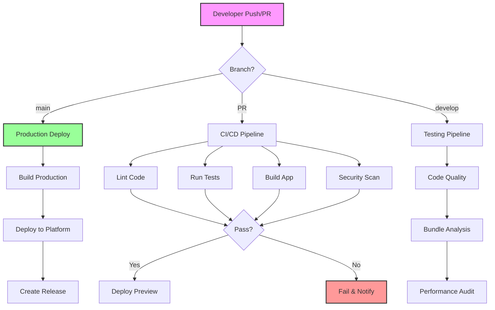

# GitHub Actions Workflow Diagram

## Workflow Triggers

### Main Branch (Production)
- Automatic deployment to production
- Release creation
- Full security scan

### Pull Requests
- CI/CD pipeline runs
- Preview deployment
- Code quality checks
- Automated tests

### Scheduled
- Weekly security scans
- Dependency updates
- Performance audits

## Secret Requirements by Workflow

### CI/CD Pipeline
- None required (uses GitHub token)

### Production Deploy
- `VERCEL_TOKEN` or `NETLIFY_AUTH_TOKEN`
- `PRODUCTION_API_URL`
- `GA_TRACKING_ID` (optional)

### Security Scan
- `SNYK_TOKEN` (optional)
- `SONAR_TOKEN` (optional)

### Release
- `NPM_TOKEN` (if publishing to npm)